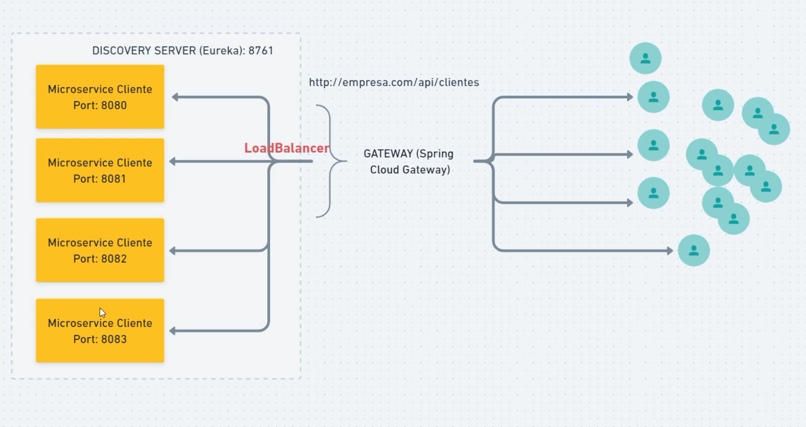
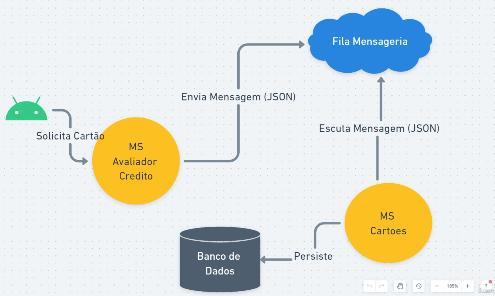
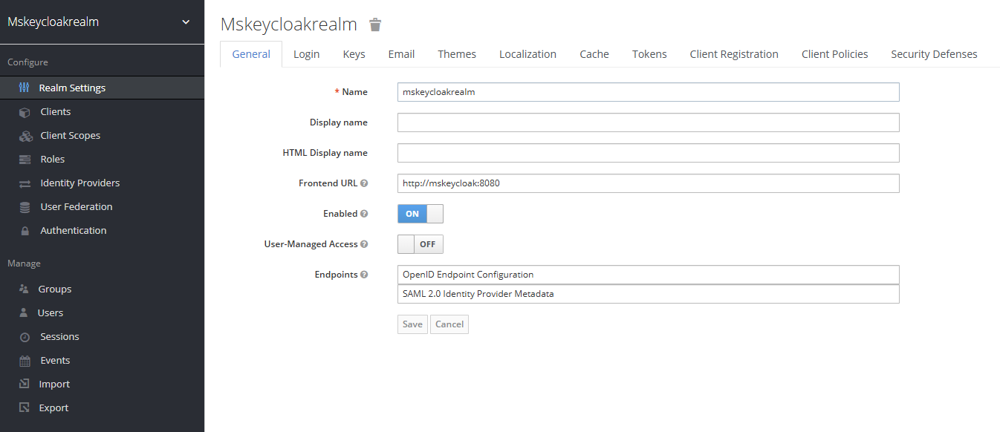
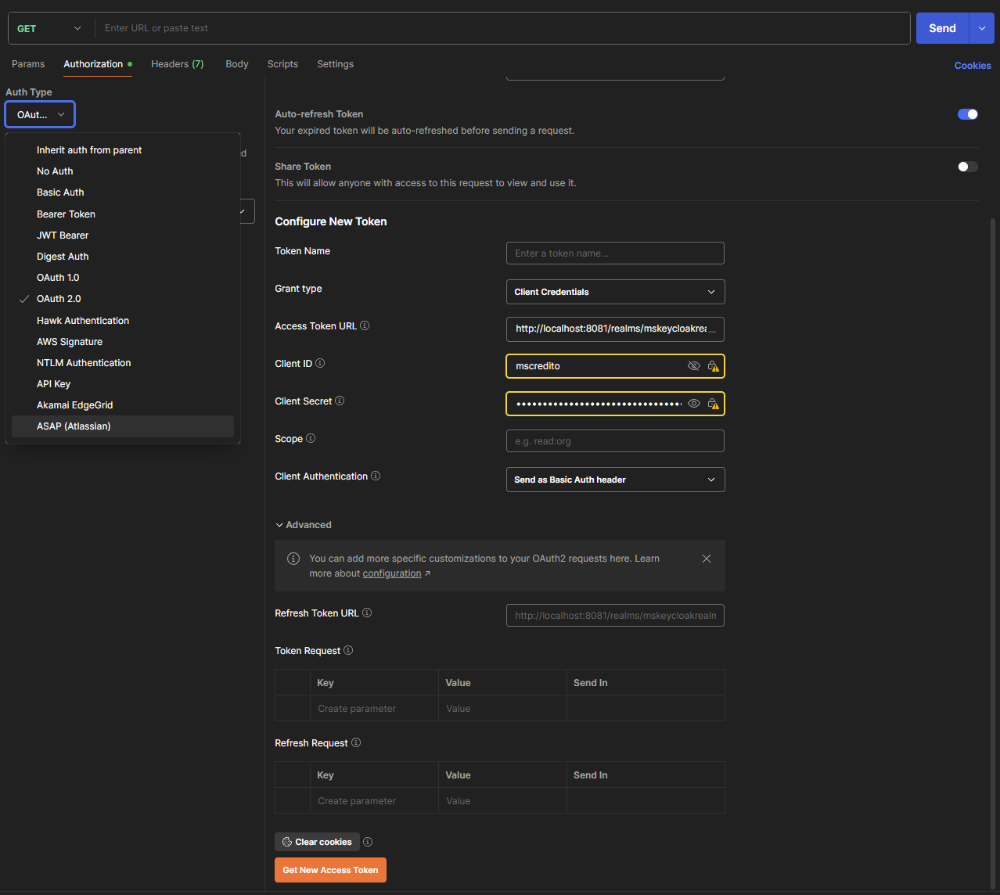
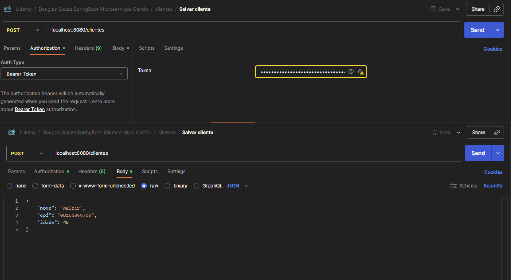
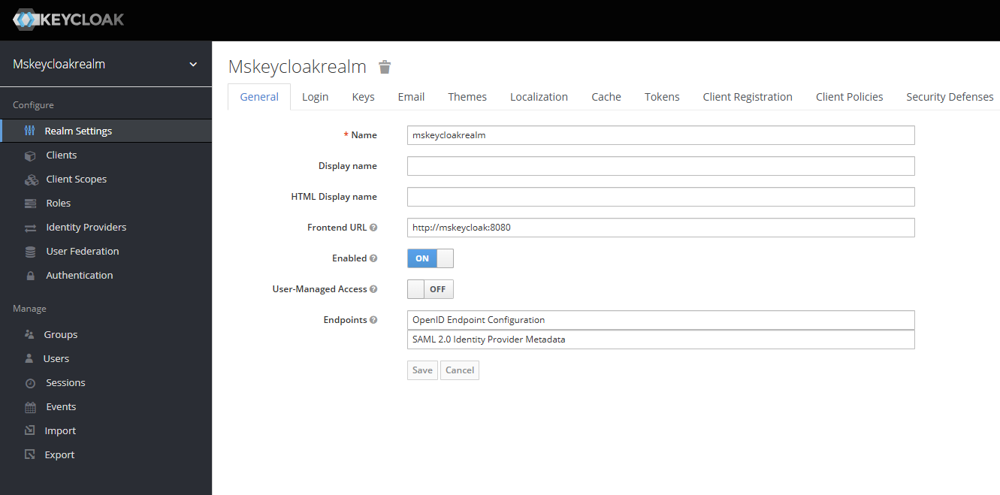

[LICENSE__BADGE]: https://img.shields.io/github/license/Fernanda-Kipper/Readme-Templates?style=for-the-badge
[JAVA_BADGE]:https://img.shields.io/badge/java-%23ED8B00.svg?style=for-the-badge&logo=openjdk&logoColor=white
[SPRING_BADGE]: https://img.shields.io/badge/spring-%236DB33F.svg?style=for-the-badge&logo=spring&logoColor=white
[RABBITMQ]:https://img.shields.io/badge/Rabbitmq-FF6600?style=for-the-badge&logo=rabbitmq&logoColor=white
[MAVEN]:https://img.shields.io/badge/apachemaven-C71A36.svg?style=for-the-badge&logo=apachemaven&logoColor=white
[POSTMAN]:https://img.shields.io/badge/Postman-FF6C37?style=for-the-badge&logo=postman&logoColor=white
[DOCKER]:https://img.shields.io/badge/docker-%230db7ed.svg?style=for-the-badge&logo=docker&logoColor=white
[KEYCLOAK]:https://img.shields.io/badge/keycloak-%233D3D3D.svg?style=for-the-badge&logo=keycloak&logoColor=white
[EUREKA]:https://img.shields.io/badge/eureka-%236DB33F.svg?style=for-the-badge&logo=spring&logoColor=white
[GATEWAY]:https://img.shields.io/badge/gateway-%236DB33F.svg?style=for-the-badge&logo=spring&logoColor=white
[H2]:https://img.shields.io/badge/h2%20database-%23005C8C.svg?style=for-the-badge&logo=h2&logoColor=white
[SPRING_SECURITY]:https://img.shields.io/badge/spring%20security-%236DB33F.svg?style=for-the-badge&logo=springsecurity&logoColor=white

<h1 align="center" style="font-weight: bold;">POC Projeto Cartões Microserviços 💻</h1>

![java][JAVA_BADGE]
![spring][SPRING_BADGE]
![spring security][SPRING_SECURITY]
![eureka][EUREKA]
![gateway][GATEWAY]
![h2][H2]
![docker][DOCKER]
![RabbitMQ][RABBITMQ]
![keycloak][KEYCLOAK]
![maven][MAVEN]
![postman][POSTMAN]
![license][LICENSE__BADGE]

---

# 📘 Índice
- [🧰 Pré-requisitos](#pre-requisitos)
- [🐳 Docker serviços e comandos úteis](#docker)
- [🧩 Fluxo Completo do Sistema](#fluxo)
- [⚙️ Arquitetura dos Microserviços](#arquitetura)
- [📡 API Endpoints](#endpoints)
  - [msclientes](#msclientes)
  - [mscartoes](#mscartoes)
  - [msavaliadorcredito](#msavaliadorcredito)
- [🔐 Autenticação via Keycloak (Gateway)](#auth)
- [🚀 Execução via Docker](#execucao-docker)
- [🤝 Colaboradores](#colaboradores)
- [📫 Como Contribuir](#como-contribuir)
- [📄 Licença](#licenca)
- [🧠 Autor](#autor)

---

<a id="pre-requisitos"></a>
# 🧰 Pré-requisitos

- **Java 21+**
- **Maven 3.9+**
- **Docker**
- **HTTP Client (Postman)**

---

<a id="docker"></a>
# 🐳 Docker serviços e comandos úteis

execute os seguintes comandos para o funcionamento do sistema :

- Criação de network docker
```bash
 docker network create <nome que quiser>  EXEMPLO: docker network create ms-network
```
- Criação do container rabbitmq
```bash
- docker run --name ms-rabbitmq -p 5672:5672 -p 15672:15672 --network ms-network rabbitmq:3.9-management
- acesso ao rabbitmq http://localhost:15672
- user : guest
- senha : guest
```

- Criação do container keycloak
```bash
- docker run -p 8081:8080 -e KEYCLOAK_ADMIN=admin -e KEYCLOAK_ADMIN_PASSWORD=admin --network ms-network --name mskeycloak quay.io/keycloak/keycloak:18.0.0 start-dev
- acesso ao keycloak http://localhost:8081/
- importar o arquivo realm-export.json
```

- Comandos docker que podem ser uteis
```bash
- docker network ls  -> visualizando todas as networks criadas
- docker images  -> verifica todas as suas imagens
- docker ps -> mostra todas as imagens em execução
- docker container stop <nome-container ou id> -> comando para parar o container
- docker container start <nome-container ou id>  -> comando para iniciar o container
- docker container rm <nome-container ou id> -> remove o container
- docker image rm <nome-container ou id> -> remove a imagem

- comando executado no terminal na pasta raiz do projeto desejado para subir mais instancias : ./mvnw spring-boot:run
```

---

<a id="fluxo"></a>
# 🧩 Fluxo Completo do Sistema

<p align="center">
<h5 style="font-weight: bold;">Funcionamento do Eureka e Gateway</h5>
    
</p>
<p align="center">
<h5 style="font-weight: bold;">Fluxo RabbitMQ</h5>
    
</p>

O ciclo de execução do projeto local segue esta sequência:

| Etapa | Descrição |
|-------|-----------|
| 1️⃣ | **Executar o ambiente**: criação da network e dos containers rabbitmq e keycloak |
| 2️⃣ | Criar um helm no keycloak para rodar local importando o arquivo realm-export.json que fica conforme imagem abaixo, para acessar (http://localhost:8081/admin/master/console/#/realms/mskeycloakrealm) |
| 3️⃣ | Subir todos projetos começando pelo eureka, para acessar (http://localhost:8761), <br/>name: cursoms-eureka-user<br/> password: ecok-usr-eeuramssur<br/>Subir por ultimo o gateway |
| 4️⃣ | Obter o token com as informações que estão no seu keycloak conforme imagem abaixo utilizando o postman. |
| 5️⃣ | **Criar um Cliente**: `POST /clientes`  **Criar um Cartão**: `POST /cartoes` Exemplo imagem abaixo criando um cliente |
| 6️⃣ | Executar os outros endpoints |
| 7️⃣ | Acesso ao banco de dados em memoria H2, http://localhost:porta/h2-console<br/>Acesso ao swagger, dentro do eureka vc acessa a url do microserviço desejado e vai abrir uma url parecida com essa  http://desktop-7uk6l4e:2538/actuator/info voce substitue o /actuator/info por /swagger-ui.html |

<p align="center">
<h5 style="font-weight: bold;">Keycloak Local</h5>
    
</p>
<p align="center">
<h5 style="font-weight: bold;">Postman Token</h5>
    
</p>
<p align="center">
<h5 style="font-weight: bold;">Postman - Criando Cliente</h5>
    
</p>

O ciclo de execução do projeto rodando com docker:

| Etapa | Descrição |
|-------|-----------|
| 1️⃣ | Executar o ambiente: criação da network e dos containers rabbitmq e keycloak. com a execução dos comandos abaixo : |
|   | docker network create ms-network<br/>docker run --name ms-rabbitmq -p 5672:5672 -p 15672:15672 --network ms-network rabbitmq:3.9-management<br/>docker run -p 8081:8080 -e KEYCLOAK_ADMIN=admin -e KEYCLOAK_ADMIN_PASSWORD=admin --network ms-network --name mskeycloak quay.io/keycloak/keycloak:18.0.0 start-dev<br/> Criar o helm conforme imagem abaixo.<br/>Fazer o build dos arquivos dockerfile, Observação : precisa estar no diretorio do arquivo dockerfile<br/>Comandos : <br/>docker build --tag ms-eureka-... |
| 2️⃣ | Criar um helm no keycloak para rodar local importando o arquivo realm-export.json que fica conforme imagem abaixo, para acessar (http://localhost:8081/admin/master/console/#/realms/mskeycloakrealm) |
| 3️⃣ | Subir todos projetos começando pelo eureka, para acessar (http://localhost:8761), <br/>name: cursoms-eureka-user<br/> password: ecok-usr-eeuramssur<br/>Subir por ultimo o gateway |
| 4️⃣ | Obter o token com as informações que estão no seu keycloak conforme imagem abaixo utilizando o postman. |
| 5️⃣ | **Criar um Cliente**: `POST /clientes`  **Criar um Cartão**: `POST /cartoes` Exemplo imagem abaixo criando um cliente |
| 6️⃣ | Executar os outros endpoints |
| 7️⃣ | Acesso ao banco de dados em memoria H2, http://localhost:porta/h2-console<br/>Acesso ao swagger, dentro do eureka vc acessa a url do microserviço desejado e vai abrir uma url parecida com essa  http://desktop-7uk6l4e:2538/actuator/info voce substitue o /actuator/info por /swagger-ui.html |

<p align="center">
<h5 style="font-weight: bold;">Keycloak Configuração para Docker</h5>
    
</p>

---

<a id="arquitetura"></a>
# ⚙️ Arquitetura dos Microserviços

| Módulo | Porta | Descrição |
|--------|--------|-----------|
| **eurekaserver** | 8761 | Registro de serviços centralizado (Service Discovery) |
| **gateway** | 8080 | API Gateway com autenticação Keycloak |
| **msclientes** | Aleatória | Cadastro e gestão de clientes |
| **mscartoes** | Aleatória | Cadastro e emissão de cartões |
| **msavaliadorcredito** | Aleatória | Análise e avaliação de crédito |

Todos os serviços se registram no **Eureka** e são roteados pelo **Gateway**, que também gerencia a autenticação via **Keycloak**.  
O **RabbitMQ** é responsável pela comunicação assíncrona entre os serviços, e o **H2 Database** é usado localmente para persistência em memória.

---

<a id="endpoints"></a>
# 📡 API Endpoints

<a id="msclientes"></a>
## 🧍‍♂️ **msclientes** (`ClienteController`)
Base: `/clientes`

| Método | Rota | Corpo (JSON) | Descrição |
|:-------:|:------|:--------------|:-----------|
| POST | `/clientes` | `Cliente` | Cadastra um novo cliente |
| GET | `/clientes/{cpf}` | - | Consulta cliente por CPF |

**Exemplo `Cliente`**
```json
{
  "nome": "Carlos da Silva",
  "cpf": "12345678900",
  "idade": 35,
  "renda": 5000.00
}
```

---

<a id="mscartoes"></a>
## 💳 **mscartoes** (`CartaoController`)
Base: `/cartoes`

| Método | Rota | Corpo (JSON) | Descrição |
|:-------:|:------|:--------------|:-----------|
| POST | `/cartoes` | `Cartao` | Cria um novo cartão |
| GET | `/cartoes` | - | Lista todos os cartões disponíveis |
| GET | `/cartoes/{renda}` | - | Lista cartões por faixa de renda |

**Exemplo `Cartao`**
```json
{
  "nome": "Cartão Visa Gold",
  "bandeira": "VISA",
  "limite": 5000.00
}
```

---

<a id="msavaliadorcredito"></a>
## 💰 **msavaliadorcredito** (`AvaliadorCreditoController`)
Base: `/avaliacoes-credito`

| Método | Rota | Corpo (JSON) | Descrição |
|:-------:|:------|:--------------|:-----------|
| POST | `/avaliacoes-credito` | `DadosAvaliacao` | Avalia o crédito do cliente |
| GET | `/avaliacoes-credito/status-cliente?cpf={cpf}` | - | Consulta situação do cliente |

**Exemplo `DadosAvaliacao`**
```json
{
  "cpf": "12345678900",
  "renda": 5000.00
}
```

**Exemplo resposta**
```json
{
  "cartoesAprovados": [
    {
      "cartao": "Visa Gold",
      "limiteAprovado": 2500.00
    }
  ]
}
```

---

<a id="auth"></a>
# 🔐 Autenticação via Keycloak (Gateway)

- Todas as requisições passam pelo **Gateway**, que valida o **Token JWT** emitido pelo **Keycloak**.  
- O token é obtido via endpoint padrão do realm:
  ```
  POST http://localhost:8081/realms/mskeycloakrealm/protocol/openid-connect/token
  ```
- As permissões são controladas pelas **roles** atribuídas aos usuários no **Keycloak**.

---

<a id="execucao-docker"></a>
# 🚀 Execução via Docker

*(mantido com comandos originais e exemplos de build/run para cada microserviço)*

---

<a id="colaboradores"></a>
# 🤝 Colaboradores

<table>
  <tr>
    <td align="center">
      <a href="https://www.linkedin.com/in/wepdev/">
        <br>
        <sub><b>Waldir Escouto Pereira</b></sub>
      </a><br>
      <sub>Desenvolvedor Back-end | Arquiteto de Microserviços</sub>
    </td>
  </tr>
</table>

---

<a id="como-contribuir"></a>
# 📫 Como Contribuir

1. Faça um **fork** do projeto
2. Crie uma **branch**:
   ```bash
   git checkout -b feature/nome-da-feature
   ```
3. Realize suas alterações e **commite** seguindo o padrão convencional:
   ```bash
   git commit -m "feat: descrição da nova funcionalidade"
   ```
4. Envie um **pull request** e aguarde a revisão.

📘 Documentações úteis:
- [Como criar um Pull Request](https://www.atlassian.com/br/git/tutorials/making-a-pull-request)
- [Padrões de Commit](https://www.conventionalcommits.org/pt-br/v1.0.0/)

---

<a id="licenca"></a>
# 📄 Licença

Este projeto está sob a licença **MIT** — consulte o arquivo [LICENSE](../LICENSE) para mais detalhes.

---

<a id="autor"></a>
### 🧠 Autor
Desenvolvido com 💙 por **Waldir Escouto Pereira**  
📍 Rio de Janeiro - Brasil  
🔗 [LinkedIn](https://www.linkedin.com/in/wepdev)
